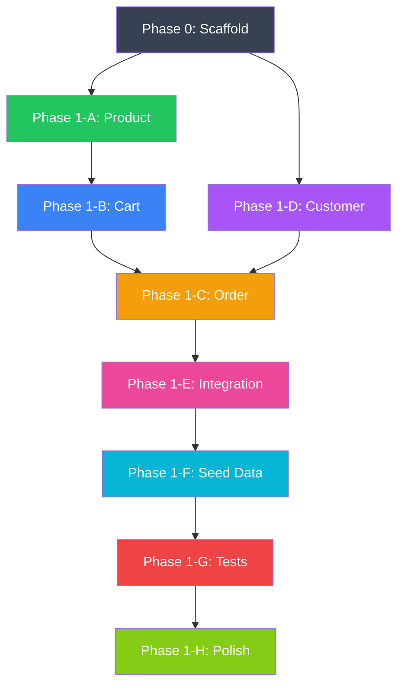

# toko-rs — Implementation Plan

## References

| Artifact | Content |
|---|---|
| [medusa_api_analysis.md](medusa_api_analysis.md) | Medusa endpoint inventory & priority tiers |
| [medusa_database_analysis.md](medusa_database_analysis.md) | Full Medusa schema vs MVP trimming |
| [toko_rs_final_schema.md](toko_rs_final_schema.md) | 11-table schema, migrations, phase compatibility |
| [toko_rs_crate_evaluation.md](toko_rs_crate_evaluation.md) | 15 runtime deps, architectural patterns, Cargo.toml |
| [toko_rs_api_contract.md](toko_rs_api_contract.md) | 20 endpoint contracts, exact JSON shapes |

| External Reference | Location | Purpose |
|---|---|---|
| Medusa OpenAPI specs | `vendor/medusa/www/utils/generated/oas-output/` | API contract source of truth |
| Medusa source code | `vendor/medusa/packages/` | Implementation reference |

---

## Project Structure (target state)

```
toko-rs/
├── Cargo.toml
├── .env
├── .env.example
├── .gitignore
├── .rustfmt.toml
├── Makefile
├── README.md
│
├── migrations/
│   ├── 001_products.sql
│   ├── 002_customers.sql
│   ├── 003_carts.sql
│   ├── 004_orders.sql
│   └── 005_payments.sql
│
├── specs/                          # OpenAPI specs (copied from vendor)
│   ├── store.oas.yaml
│   └── admin.oas.yaml
│
├── vendor/
│   └── medusa/                     # git submodule → medusajs/medusa develop
│
├── src/
│   ├── main.rs                     # Entry point, server setup
│   ├── config.rs                   # Environment config
│   ├── db.rs                       # AnyPool setup, migrations
│   ├── error.rs                    # AppError (MedusaError-compatible)
│   ├── types.rs                    # ID generation, FindParams, pagination
│   │
│   ├── product/
│   │   ├── mod.rs
│   │   ├── model.rs                # Product, Variant, Option, OptionValue
│   │   ├── repo.rs                 # SQL queries
│   │   ├── routes.rs               # Admin + Store handlers
│   │   └── params.rs               # Request/response types
│   │
│   ├── cart/
│   │   ├── mod.rs
│   │   ├── model.rs                # Cart, LineItem
│   │   ├── repo.rs
│   │   ├── routes.rs
│   │   └── params.rs
│   │
│   ├── order/
│   │   ├── mod.rs
│   │   ├── model.rs                # Order, OrderLineItem
│   │   ├── repo.rs
│   │   ├── routes.rs
│   │   └── params.rs
│   │
│   ├── customer/
│   │   ├── mod.rs
│   │   ├── model.rs                # Customer
│   │   ├── repo.rs
│   │   ├── routes.rs
│   │   └── params.rs
│   │
│   ├── payment/
│   │   ├── mod.rs
│   │   ├── model.rs                # PaymentRecord
│   │   └── repo.rs
│   │
│   └── seed.rs                     # Sample data for development
│
└── tests/
    ├── common/
    │   └── mod.rs                  # Test helpers (setup DB, create app)
    ├── product_test.rs
    ├── cart_test.rs
    ├── order_test.rs
    └── customer_test.rs
```

---

## Phase 0 — Project Scaffold

### 0.1 Git & Workspace Setup

- [ ] Create project directory at `./toko-rs/`
- [ ] `cargo init` — initialize Rust project
- [ ] Create `.gitignore` (target/, .env, *.db)
- [ ] Create `.rustfmt.toml` (max_width = 100, edition = 2024)
- [ ] `git init` + initial commit

### 0.2 Vendor Submodule

- [ ] `git submodule add -b develop https://github.com/medusajs/medusa.git vendor/medusa`
- [ ] Copy OpenAPI specs from `vendor/medusa/www/utils/generated/oas-output/` → `specs/`
- [ ] Verify: `ls vendor/medusa/packages/modules/product/src/models/`

### 0.3 Cargo.toml

- [ ] Write full `Cargo.toml` per [toko_rs_crate_evaluation.md](toko_rs_crate_evaluation.md)
- [ ] Verify: `cargo check` compiles with all 15 dependencies

### 0.4 Core Foundation Files

- [ ] **`src/config.rs`** — AppConfig struct
  - Fields: `database_url`, `host`, `port`, `rust_log`
  - Load from env with `dotenvy`
  - Reference: Medusa's `medusa.config.ts`
  
- [ ] **`src/error.rs`** — AppError enum
  - Variants: NotFound, InvalidData, DuplicateError, Unauthorized, DatabaseError, UnexpectedState
  - Implement `IntoResponse` for Axum
  - Reference: `vendor/medusa/packages/core/utils/src/common/errors.ts`

- [ ] **`src/types.rs`** — Shared types
  - `generate_entity_id(existing: Option<&str>, prefix: &str) -> String`
  - `FindParams` struct (offset, limit, order, fields, with_deleted)
  - `generate_handle(title: &str) -> String` using `slug` crate
  - Reference: `vendor/medusa/packages/core/utils/src/common/generate-entity-id.ts`

- [ ] **`src/db.rs`** — Database setup
  - `create_pool(database_url: &str) -> AnyPool`
  - Pool config: min=2, max=10, idle_timeout=5min
  - `run_migrations(pool: &AnyPool)` — execute migration files
  - Connection health check with retry
  - Reference: `vendor/medusa/packages/core/framework/src/database/pg-connection-loader.ts`

- [ ] **`src/main.rs`** — Server entry point (skeleton)
  - Init tracing (3 layers: HTTP, app, sqlx)
  - Load config
  - Create DB pool + run migrations
  - Build Axum router (empty routes for now)
  - `axum::serve` with graceful shutdown
  - `--seed` CLI flag check

- [ ] **`.env` + `.env.example`**
  ```
  DATABASE_URL=sqlite://toko.db?mode=rwc
  HOST=0.0.0.0
  PORT=3000
  RUST_LOG=toko_rs=debug,tower_http=debug
  ```

- [ ] Verify: `cargo run` starts server, connects to SQLite, runs migrations, listens on port 3000

### 0.5 SQL Migrations

- [ ] **`migrations/001_products.sql`** — products, product_options, product_option_values, product_variants, product_variant_options
- [ ] **`migrations/002_customers.sql`** — customers, customer_addresses
- [ ] **`migrations/003_carts.sql`** — carts, cart_line_items
- [ ] **`migrations/004_orders.sql`** — orders, order_line_items
- [ ] **`migrations/005_payments.sql`** — payment_records
- [ ] All SQL per [toko_rs_final_schema.md](toko_rs_final_schema.md)
- [ ] Verify: `cargo run` creates all 11 tables + 1 pivot in SQLite

### 0.6 Makefile

- [ ] Create `Makefile` with common commands:
  ```makefile
  dev:       cargo run
  test:      cargo test
  check:     cargo check
  lint:      cargo clippy -- -D warnings
  fmt:       cargo fmt
  seed:      cargo run -- --seed
  clean-db:  rm -f toko.db
  ```

**Phase 0 gate**: Server starts, creates all tables, logs requests, responds 404 to any route.

---

## Phase 1-A — Product Module

> **Reference**: `vendor/medusa/packages/modules/product/src/models/`
> **Contract**: [toko_rs_api_contract.md](toko_rs_api_contract.md) § Admin + Store Products

### 1A.1 Models (`src/product/model.rs`)

- [ ] `Product` struct — id, title, handle, description, status, thumbnail, metadata, created_at, updated_at, deleted_at
- [ ] `ProductOption` struct — id, product_id, title, created_at, updated_at, deleted_at
- [ ] `ProductOptionValue` struct — id, option_id, value, created_at, updated_at, deleted_at
- [ ] `ProductVariant` struct — id, product_id, title, sku, price, variant_rank, metadata, created_at, updated_at, deleted_at
- [ ] `ProductWithRelations` struct — Product + Vec\<OptionWithValues\> + Vec\<VariantWithOptions\>
- [ ] All structs derive `Serialize`, `Deserialize`, `sqlx::FromRow`
- [ ] Reference: `vendor/medusa/packages/modules/product/src/models/product.ts`

### 1A.2 Request/Response Types (`src/product/params.rs`)

- [ ] `AdminCreateProductRequest` — title (required), handle, description, status, thumbnail, metadata, options, variants
- [ ] `AdminCreateVariantInput` — title (required), sku, price (required), options, metadata
- [ ] `AdminCreateOptionInput` — title (required), values (Vec\<String\>)
- [ ] `AdminUpdateProductRequest` — all fields optional
- [ ] `AdminAddVariantRequest` — same as create variant input
- [ ] `ProductResponse` — wraps `{"product": ProductWithRelations}`
- [ ] `ProductListResponse` — wraps `{"products": [...], "count", "offset", "limit"}`
- [ ] `DeleteResponse` — `{"id", "object", "deleted"}`
- [ ] Validation: title non-empty, price > 0, quantity > 0
- [ ] Reference: `vendor/medusa/packages/medusa/src/api/admin/products/validators.ts`

### 1A.3 Repository (`src/product/repo.rs`)

- [ ] `create(pool, input) -> Product` — INSERT product, options, option_values, variants, pivot entries (in transaction)
- [ ] `find_by_id(pool, id) -> ProductWithRelations` — SELECT with JOINs
- [ ] `list(pool, params) -> (Vec<ProductWithRelations>, count)` — pagination, soft delete filter
- [ ] `list_published(pool, params)` — WHERE status = 'published' AND deleted_at IS NULL
- [ ] `update(pool, id, input) -> Product` — UPDATE with updated_at
- [ ] `soft_delete(pool, id)` — SET deleted_at = CURRENT_TIMESTAMP
- [ ] `add_variant(pool, product_id, input) -> Variant` — INSERT variant + pivot
- [ ] All queries use `$1, $2, $3` placeholders (AnyPool compatible)
- [ ] Reference: `vendor/medusa/packages/modules/product/src/services/product-module-service.ts`

### 1A.4 Routes (`src/product/routes.rs`)

- [ ] `POST /admin/products` → `admin_create_product`
- [ ] `GET /admin/products` → `admin_list_products`
- [ ] `GET /admin/products/:id` → `admin_get_product`
- [ ] `POST /admin/products/:id` → `admin_update_product`
- [ ] `DELETE /admin/products/:id` → `admin_delete_product`
- [ ] `POST /admin/products/:id/variants` → `admin_add_variant`
- [ ] `GET /store/products` → `store_list_products` (published only)
- [ ] `GET /store/products/:id` → `store_get_product` (published only)
- [ ] All handlers use `#[tracing::instrument]`
- [ ] Wire into Axum router in `mod.rs`

### 1A.5 Product Tests

- [ ] Unit test: `generate_handle("Classic T-Shirt")` → `"classic-t-shirt"`
- [ ] Integration test: Create product via admin → retrieve via store
- [ ] Integration test: Create product with options + variants → verify response shape
- [ ] Integration test: Update product → verify updated fields
- [ ] Integration test: Delete product → verify 404 on store, visible with `with_deleted`
- [ ] Contract test: Response JSON matches [toko_rs_api_contract.md](toko_rs_api_contract.md) shape

**Phase 1-A gate**: All 8 product endpoints work. Admin can create/update/delete products. Store shows only published products.

---

## Phase 1-B — Cart Module

> **Reference**: `vendor/medusa/packages/modules/cart/src/models/`
> **Contract**: [toko_rs_api_contract.md](toko_rs_api_contract.md) § Store Carts

### 1B.1 Models (`src/cart/model.rs`)

- [ ] `Cart` struct — id, customer_id, email, currency_code, shipping_address (JSON), billing_address (JSON), metadata, completed_at, created_at, updated_at, deleted_at
- [ ] `CartLineItem` struct — id, cart_id, title, quantity, unit_price, variant_id, product_id, snapshot (JSON), metadata, created_at, updated_at, deleted_at
- [ ] `CartWithItems` struct — Cart + Vec\<CartLineItem\> + computed totals (item_total, total)
- [ ] `LineItemSnapshot` struct (JSON) — product_title, variant_title, variant_sku
- [ ] Reference: `vendor/medusa/packages/modules/cart/src/models/cart.ts`

### 1B.2 Request/Response Types (`src/cart/params.rs`)

- [ ] `StoreCreateCartRequest` — currency_code, email, metadata
- [ ] `StoreUpdateCartRequest` — email, metadata (all optional)
- [ ] `StoreAddLineItemRequest` — variant_id (required), quantity (required, > 0), metadata
- [ ] `StoreUpdateLineItemRequest` — quantity (required, >= 0), metadata
- [ ] `CartResponse` — wraps `{"cart": CartWithItems}`
- [ ] Validation: quantity > 0 on add, quantity >= 0 on update
- [ ] Reference: `vendor/medusa/packages/medusa/src/api/store/carts/validators.ts`

### 1B.3 Repository (`src/cart/repo.rs`)

- [ ] `create(pool, input) -> Cart` — INSERT cart
- [ ] `find_by_id(pool, id) -> CartWithItems` — SELECT cart + LEFT JOIN line_items
- [ ] `update(pool, id, input) -> Cart` — UPDATE email, metadata, updated_at
- [ ] `add_line_item(pool, cart_id, variant_id, quantity)` — Lookup variant for price + snapshot, INSERT line_item
- [ ] `update_line_item(pool, cart_id, line_item_id, quantity)` — UPDATE quantity, if 0: soft delete
- [ ] `remove_line_item(pool, cart_id, line_item_id)` — soft delete
- [ ] `mark_completed(pool, cart_id)` — SET completed_at = now
- [ ] Cart validation: check not already completed before mutations
- [ ] Reference: `vendor/medusa/packages/modules/cart/src/services/cart-module-service.ts`

### 1B.4 Routes (`src/cart/routes.rs`)

- [ ] `POST /store/carts` → `store_create_cart`
- [ ] `GET /store/carts/:id` → `store_get_cart`
- [ ] `POST /store/carts/:id` → `store_update_cart`
- [ ] `POST /store/carts/:id/line-items` → `store_add_line_item`
- [ ] `POST /store/carts/:id/line-items/:line_id` → `store_update_line_item`
- [ ] `DELETE /store/carts/:id/line-items/:line_id` → `store_remove_line_item`

### 1B.5 Cart Tests

- [ ] Integration: Create cart → add item → verify totals
- [ ] Integration: Add item → update quantity → verify recalculation
- [ ] Integration: Add item → remove item → verify empty cart
- [ ] Integration: Add item with invalid variant_id → 404 error
- [ ] Integration: Update completed cart → 409 unexpected_state
- [ ] Integration: Add line item with quantity 0 → 400 invalid_data

**Phase 1-B gate**: Full cart CRUD works. Line items snapshot product data. Totals compute correctly.

---

## Phase 1-C — Order Module

> **Reference**: `vendor/medusa/packages/modules/order/src/models/`
> **Contract**: [toko_rs_api_contract.md](toko_rs_api_contract.md) § Store Orders + Cart Complete

### 1C.1 Models (`src/order/model.rs`)

- [ ] `Order` struct — id, display_id, customer_id, email, currency_code, status, shipping_address (JSON), billing_address (JSON), metadata, canceled_at, created_at, updated_at, deleted_at
- [ ] `OrderLineItem` struct — id, order_id, title, quantity, unit_price, variant_id, product_id, snapshot (JSON), metadata, created_at, updated_at, deleted_at
- [ ] `OrderWithItems` struct — Order + Vec\<OrderLineItem\> + PaymentRecord + computed totals
- [ ] Reference: `vendor/medusa/packages/modules/order/src/models/order.ts`

### 1C.2 Payment Model (`src/payment/model.rs` + `repo.rs`)

- [ ] `PaymentRecord` struct — id, order_id, amount, currency_code, status, provider, metadata, created_at, updated_at
- [ ] `create(pool, order_id, amount, currency_code) -> PaymentRecord`
- [ ] `find_by_order_id(pool, order_id) -> PaymentRecord`

### 1C.3 Repository (`src/order/repo.rs`)

- [ ] `create_from_cart(pool, cart: CartWithItems) -> OrderWithItems` — Transaction:
  1. Generate order ID + display_id (auto-increment via MAX+1)
  2. INSERT order (copy email, currency_code, addresses from cart)
  3. INSERT order_line_items (copy from cart_line_items)
  4. INSERT payment_record (status=pending, amount=total)
  5. Mark cart as completed
- [ ] `find_by_id(pool, id) -> OrderWithItems`
- [ ] `list_by_customer(pool, customer_id, params) -> (Vec<OrderWithItems>, count)`
- [ ] Reference: `vendor/medusa/packages/modules/order/src/services/order-module-service.ts`

### 1C.4 Routes (`src/order/routes.rs`)

- [ ] `POST /store/carts/:id/complete` → `store_complete_cart`
  - Validate: cart exists, not already completed, has items
  - Create order from cart
  - Return `{"type": "order", "order": {...}}`
- [ ] `GET /store/orders` → `store_list_orders` (filtered by customer_id from header)
- [ ] `GET /store/orders/:id` → `store_get_order`

### 1C.5 Order Tests

- [ ] Integration: Complete flow — create cart → add items → complete → verify order
- [ ] Integration: Complete empty cart → 409 error
- [ ] Integration: Complete already-completed cart → 409 error
- [ ] Integration: Order display_id auto-increments
- [ ] Integration: Order items match cart items (snapshot preserved)
- [ ] Integration: Payment record created with correct amount

**Phase 1-C gate**: Cart-to-order conversion works. Orders persist with line items and payment records.

---

## Phase 1-D — Customer Module

> **Reference**: `vendor/medusa/packages/modules/customer/src/models/`
> **Contract**: [toko_rs_api_contract.md](toko_rs_api_contract.md) § Store Customers

### 1D.1 Models (`src/customer/model.rs`)

- [ ] `Customer` struct — id, first_name, last_name, email, phone, has_account, metadata, created_at, updated_at, deleted_at
- [ ] Reference: `vendor/medusa/packages/modules/customer/src/models/customer.ts`

### 1D.2 Request/Response Types (`src/customer/params.rs`)

- [ ] `StoreCreateCustomerRequest` — email (required), first_name, last_name, phone
- [ ] `StoreUpdateCustomerRequest` — all optional
- [ ] `CustomerResponse` — wraps `{"customer": Customer}`
- [ ] Reference: `vendor/medusa/packages/medusa/src/api/store/customers/validators.ts`

### 1D.3 Repository (`src/customer/repo.rs`)

- [ ] `create(pool, input) -> Customer` — INSERT, set has_account=true
- [ ] `find_by_id(pool, id) -> Customer`
- [ ] `find_by_email(pool, email) -> Option<Customer>`
- [ ] `update(pool, id, input) -> Customer`
- [ ] Duplicate email check → DuplicateError

### 1D.4 Routes (`src/customer/routes.rs`)

- [ ] `POST /store/customers` → `store_create_customer`
- [ ] `GET /store/customers/me` → `store_get_customer` (customer_id from `X-Customer-Id` header)
- [ ] `POST /store/customers/me` → `store_update_customer`

### 1D.5 Customer Tests

- [ ] Integration: Register customer → retrieve profile
- [ ] Integration: Update profile → verify changes
- [ ] Integration: Register duplicate email → 409 duplicate_error
- [ ] Integration: Get /me without header → 401 unauthorized

**Phase 1-D gate**: Customer registration and profile management works.

---

## Phase 1-E — Integration & Wiring

### 1E.1 Router Assembly (`src/main.rs`)

- [ ] Mount all module routes:
  ```
  /admin/products/*     → product::routes::admin_router()
  /store/products/*     → product::routes::store_router()
  /store/carts/*        → cart::routes::router()
  /store/orders/*       → order::routes::router()
  /store/customers/*    → customer::routes::router()
  /health               → health_check()
  ```
- [ ] Apply middleware layers:
  - `TraceLayer::new_for_http()`
  - `CorsLayer` (allow all for dev)
- [ ] Pass `AnyPool` as Axum `State`

### 1E.2 Health Check

- [ ] `GET /health` → `{"status": "ok"|"degraded", "database": "connected"|"disconnected", "version": "0.1.0"}`

### 1E.3 Customer ID Middleware (P1 stub for auth)

- [ ] Extract `X-Customer-Id` header for customer-scoped endpoints
- [ ] `/store/customers/me` and `/store/orders` require this header
- [ ] Return 401 if missing on protected endpoints

### 1E.4 Cross-Module Integration

- [ ] Cart → Product: Adding line item looks up variant price + creates snapshot
- [ ] Cart → Order: Complete cart creates order + payment record
- [ ] Cart → Customer: Optional customer_id linkage on cart
- [ ] Order → Customer: Order list filtered by customer_id

**Phase 1-E gate**: All 20 endpoints respond. Middleware works. Cross-module flows execute correctly.

---

## Phase 1-F — Seed Data

### 1F.1 Seed Script (`src/seed.rs`)

- [ ] Create 3-5 sample products:
  - "Classic T-Shirt" — options: Size (S/M/L), Color (Red/Blue) → 6 variants
  - "Running Shoes" — options: Size (40/41/42/43) → 4 variants
  - "Coffee Mug" — no options → 1 variant (default)
- [ ] Create 1 sample customer:
  - "Budi Santoso", budi@example.com
- [ ] All products set to `status: "published"`
- [ ] Reference: realistic product data for demo/testing

### 1F.2 Seed Command

- [ ] `cargo run -- --seed` runs seed and exits
- [ ] Seed is idempotent (checks if data exists before inserting)

### 1F.3 Smoke Test via curl

- [ ] Run full Browse → Cart → Checkout flow using curl commands from [toko_rs_crate_evaluation.md](toko_rs_crate_evaluation.md)
- [ ] Verify all 20 endpoints return correct JSON shapes

**Phase 1-F gate**: `cargo run -- --seed && cargo run` starts a working e-commerce backend with sample data.

---

## Phase 1-G — Test Suite

### 1G.1 Test Infrastructure (`tests/common/mod.rs`)

- [ ] `setup_test_db() -> AnyPool` — in-memory SQLite, run migrations
- [ ] `create_test_app(pool) -> Router` — build full Axum app for testing
- [ ] `spawn_test_server(app) -> (String, JoinHandle)` — bind to random port
- [ ] Helper: `seed_test_product(pool) -> ProductWithRelations`
- [ ] Helper: `seed_test_customer(pool) -> Customer`

### 1G.2 Product Tests (`tests/product_test.rs`)

- [ ] Admin: create product → 200, correct shape
- [ ] Admin: create product without title → 400 invalid_data
- [ ] Admin: create with duplicate handle → 409 duplicate_error
- [ ] Admin: list products → pagination works
- [ ] Admin: update product → fields change
- [ ] Admin: delete product → soft deleted
- [ ] Store: list → only published products
- [ ] Store: get deleted product → 404
- [ ] Store: get draft product → 404

### 1G.3 Cart Tests (`tests/cart_test.rs`)

- [ ] Create cart → 200
- [ ] Add line item → cart total updates
- [ ] Update line item quantity → total recalculates
- [ ] Remove line item → item gone from cart
- [ ] Add item with bad variant_id → 404
- [ ] Cart with 3 different items → totals correct
- [ ] Update completed cart → 409

### 1G.4 Order Tests (`tests/order_test.rs`)

- [ ] Full flow: product → cart → add items → complete → order exists
- [ ] Complete empty cart → 409
- [ ] Order has correct items and totals
- [ ] Order has payment_record
- [ ] Order display_id increments
- [ ] List orders filtered by customer

### 1G.5 Customer Tests (`tests/customer_test.rs`)

- [ ] Register → 200
- [ ] Register duplicate email → 409
- [ ] Get me → 200
- [ ] Update me → fields change
- [ ] Get me without X-Customer-Id → 401

### 1G.6 Contract Tests

- [ ] Every endpoint response matches shape from [toko_rs_api_contract.md](toko_rs_api_contract.md)
- [ ] Use `assert-json-diff` to compare response structure
- [ ] Error responses match MedusaError format

**Phase 1-G gate**: `cargo test` passes all tests. 100% endpoint coverage.

---

## Phase 1-H — Polish & Documentation

### 1H.1 Code Quality

- [ ] `cargo clippy -- -D warnings` — zero warnings
- [ ] `cargo fmt` — consistent formatting
- [ ] All public functions have doc comments
- [ ] `tracing::instrument` on all handlers

### 1H.2 README.md

- [ ] Project description
- [ ] Quick start (`cargo run -- --seed`)
- [ ] API endpoint table
- [ ] curl examples for the full flow
- [ ] Architecture overview
- [ ] Link to Medusa as reference

### 1H.3 Walkthrough Artifact

- [ ] Create `walkthrough.md` documenting:
  - What was built
  - Architecture decisions
  - How to run and test
  - What's next (P2)

**Phase 1-H gate**: Clean, documented, ready for P2 extension.

---

## Execution Order & Dependencies



| Phase | Est. Files | Depends On | Key Deliverable |
|---|---|---|---|
| **P0** | ~12 | — | Server starts, DB created |
| **P1-A** | 5 | P0 | 8 product endpoints |
| **P1-B** | 5 | P1-A | 6 cart endpoints |
| **P1-C** | 5 | P1-B, P1-D | 3 order endpoints + cart complete |
| **P1-D** | 5 | P0 | 3 customer endpoints |
| **P1-E** | 2 | P1-A–D | All 20 endpoints wired |
| **P1-F** | 1 | P1-E | Seed data + smoke test |
| **P1-G** | 5 | P1-F | Full test suite |
| **P1-H** | 2 | P1-G | README + walkthrough |

---

## Verification Plan

### Automated Tests

```bash
cargo test                        # All unit + integration tests
cargo clippy -- -D warnings       # Lint
cargo fmt -- --check              # Format check
```

### Manual Verification

After `cargo run -- --seed && cargo run`:

```bash
# Full Browse → Cart → Checkout flow
curl localhost:3000/store/products                              # Browse
curl -X POST localhost:3000/store/carts -d '{"currency_code":"usd"}'  # Create cart
curl -X POST localhost:3000/store/carts/$CART_ID/line-items \
  -d '{"variant_id":"$VID","quantity":2}'                       # Add to cart
curl -X POST localhost:3000/store/carts/$CART_ID/complete       # Checkout
curl localhost:3000/store/orders/$ORDER_ID                      # View order
```

### Contract Validation

- Each endpoint response checked against [toko_rs_api_contract.md](toko_rs_api_contract.md) shapes
- Error responses match MedusaError format
- Pagination follows Medusa convention (count/offset/limit)
