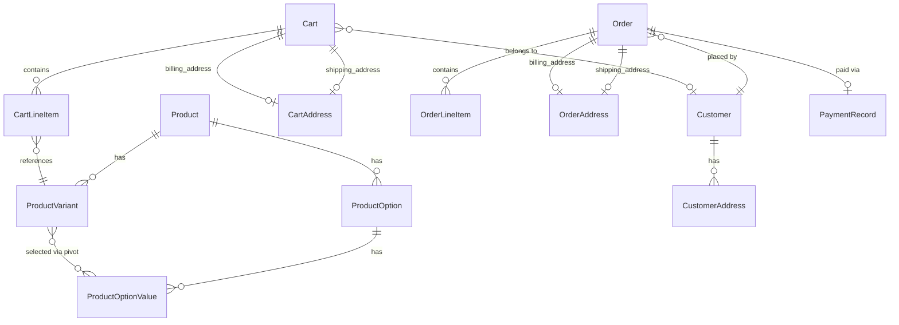

# Medusa v2 Database Structure — From Source Code

> **Source**: Actual model files from `packages/modules/*/src/models/*.ts`
> **ORM**: Medusa v2 uses `@medusajs/framework/utils` DLL (Data Layer Language)

---

## Full Model Inventory — What Medusa Actually Has

### Product Module (11 models → 11 tables)

| Model (Table) | Key Fields | Relationships |
|---|---|---|
| **Product** | id, title, handle, subtitle, description, is_giftcard, status (DRAFT/PUBLISHED/PROPOSED/REJECTED), thumbnail, weight, length, height, width, origin_country, hs_code, mid_code, material, discountable, external_id, metadata | → variants, options, images, type, tags, collection, categories |
| **ProductVariant** | id, title, sku, barcode, ean, upc, allow_backorder, manage_inventory, hs_code, origin_country, mid_code, material, weight, length, height, width, metadata, variant_rank, thumbnail | → product, options (M2M via product_variant_option), images |
| **ProductOption** | id, title | → product, values |
| **ProductOptionValue** | id, value | → option, variants (M2M) |
| **ProductImage** | id, url, rank | → product, variants |
| **ProductType** | id, value | → products |
| **ProductTag** | id, value | → products (M2M via product_tags) |
| **ProductCollection** | id, title, handle | → products |
| **ProductCategory** | id, name, description, handle, is_active, is_internal, rank | → parent, children, products (M2M via product_category_product) |
| product_tags | *(pivot)* product_id, tag_id | |
| product_variant_option | *(pivot)* variant_id, option_value_id | |
| product_category_product | *(pivot)* product_id, category_id | |

---

### Cart Module (10 models → 10 tables)

| Model (Table) | Key Fields | Relationships |
|---|---|---|
| **Cart** | id, region_id, customer_id, sales_channel_id, email, currency_code, locale, metadata, completed_at | → shipping_address, billing_address, items, credit_lines, shipping_methods |
| **Address** (cart_address) | id, customer_id, company, first_name, last_name, address_1, address_2, city, country_code, province, postal_code, phone, metadata | *(owned by Cart)* |
| **LineItem** (cart_line_item) | id, title, subtitle, thumbnail, **quantity**, variant_id, product_id, product_title, product_description, product_subtitle, product_type, product_type_id, product_collection, product_handle, variant_sku, variant_barcode, variant_title, variant_option_values (JSON), requires_shipping, is_discountable, is_giftcard, is_tax_inclusive, is_custom_price, compare_at_unit_price, **unit_price**, metadata | → cart, adjustments, tax_lines |
| **LineItemAdjustment** | id, description, promotion_id, code, amount, provider_id, metadata | → item (LineItem) |
| **LineItemTaxLine** | id, description, tax_rate_id, code, rate, provider_id, metadata | → item (LineItem) |
| **ShippingMethod** | id, name, description, amount, is_tax_inclusive, shipping_option_id, data (JSON), metadata | → cart, adjustments, tax_lines |
| **ShippingMethodAdjustment** | id, description, promotion_id, code, amount, provider_id, metadata | → shipping_method |
| **ShippingMethodTaxLine** | id, description, tax_rate_id, code, rate, provider_id, metadata | → shipping_method |
| **CreditLine** | id, reference, reference_id, amount, raw_amount (JSON), metadata | → cart |

> [!NOTE]
> **Key insight**: The LineItem table **denormalizes** product data (product_title, variant_sku, etc.) — it snapshots the product at the time of adding to cart. This is intentional so the cart survives if the product is later deleted or modified.

---

### Order Module (21 models → 21 tables) ← **THE BIGGEST**

| Model (Table) | Key Fields | Relationships |
|---|---|---|
| **Order** | id, display_id (auto-increment), custom_display_id, region_id, customer_id, **version**, sales_channel_id, status (PENDING/COMPLETED/DRAFT/REQUIRES_ACTION/CANCELED/ARCHIVED), is_draft_order, email, currency_code, locale, no_notification, metadata, canceled_at | → shipping/billing_address, summary, items, shipping_methods, transactions, credit_lines, returns |
| **OrderItem** | id, **version**, unit_price, compare_at_unit_price, quantity, fulfilled_quantity, delivered_quantity, shipped_quantity, return_requested_quantity, return_received_quantity, return_dismissed_quantity, written_off_quantity, metadata | → order, item (OrderLineItem) |
| **OrderLineItem** | id, title, subtitle, thumbnail, quantity, variant_id, product_id, product_title, *(same denormalized fields as cart LineItem)*, unit_price, metadata | → adjustments, tax_lines |
| **OrderAddress** | id, customer_id, company, first_name, last_name, address_1, address_2, city, country_code, province, postal_code, phone, metadata | |
| **OrderSummary** | id, version, totals (JSON) | → order |
| **OrderShipping** | id, version, name, description, amount, shipping_option_id, data (JSON), metadata | → order, adjustments, tax_lines |
| **OrderTransaction** | id, version, amount, raw_amount, currency_code, reference, reference_id, metadata | → order |
| **OrderChange** | id, version, change_type, description, status, internal_note, requested/confirmed/declined/canceled_by, requested/confirmed/declined/canceled_at, metadata | → order, actions, return, claim, exchange |
| **OrderChangeAction** | id, version, ordering, action, reference, reference_id, details (JSON), amount, raw_amount, internal_note, applied | → order_change |
| **Claim** | id, type (REFUND/REPLACE), order_version, display_id, no_notification, metadata, return | → order, additional_items, claim_items, return, shipping_methods |
| **ClaimItem** | id, reason (MISSING/WRONG/PRODUCTION/OTHER), quantity, metadata | → claim, item, images |
| **ClaimItemImage** | id, url, metadata | → claim_item |
| **Exchange** | id, order_version, display_id, no_notification, metadata | → order, additional_items, return, shipping_methods |
| **ExchangeItem** | id, quantity, metadata | → exchange, item |
| **Return** | id, order_version, display_id, status, refund_amount, no_notification, metadata | → order, items, shipping_methods |
| **ReturnItem** | id, reason_id, quantity, received_quantity, damaged_quantity, note, metadata | → return, item |
| **ReturnReason** | id, value, label, description, metadata | → parent, children |
| **LineItemAdjustment** | *(same structure as cart)* | |
| **LineItemTaxLine** | *(same structure as cart)* | |
| **ShippingMethodAdjustment** | *(same structure as cart)* | |
| **ShippingMethodTaxLine** | *(same structure as cart)* | |
| **OrderCreditLine** | id, reference, reference_id, amount, raw_amount, metadata | → order |

> [!WARNING]
> The Order module is **extremely complex** by design. It supports versioning (immutable order history), claims, exchanges, returns, and full financial transaction tracking. This is the main area to trim for MVP.

---

### Customer Module (4 models → 4 tables)

| Model (Table) | Key Fields | Relationships |
|---|---|---|
| **Customer** | id, company_name, first_name, last_name, email, phone, has_account, metadata, created_by | → groups (M2M), addresses |
| **CustomerAddress** | id, address_name, is_default_shipping, is_default_billing, company, first_name, last_name, address_1, address_2, city, country_code, province, postal_code, phone, metadata | → customer |
| **CustomerGroup** | id, name, metadata | → customers (M2M) |
| **CustomerGroupCustomer** | *(pivot)* customer_id, group_id | |

---

### Payment Module (9 models → 9 tables)

| Model (Table) | Key Fields | Relationships |
|---|---|---|
| **PaymentCollection** | id, currency_code, amount, authorized_amount, captured_amount, refunded_amount, completed_at, status (NOT_PAID/AWAITING/AUTHORIZED/PARTIALLY_AUTHORIZED/CANCELED), metadata | → payment_providers (M2M), payment_sessions, payments |
| **PaymentSession** | id, currency_code, amount, provider_id, data (JSON), context (JSON), status, authorized_at, metadata | → payment_collection |
| **Payment** | id, amount, raw_amount, authorized_amount, currency_code, provider_id, data (JSON), metadata | → payment_collection, captures, refunds |
| **PaymentProvider** | id, is_enabled | → payment_collections (M2M) |
| **Capture** | id, amount, raw_amount, metadata | → payment |
| **Refund** | id, amount, raw_amount, note, metadata | → payment, refund_reason |
| **RefundReason** | id, label, description, metadata | → refunds |
| **AccountHolder** | id, provider_id, external_id, email, metadata | |

---

## The Stark Reality: Medusa's Full Schema

```
Product Module:     11 tables (+ 3 pivot tables)
Cart Module:        10 tables
Order Module:       21 tables   ← !!
Customer Module:     4 tables
Payment Module:      9 tables
─────────────────────────────
TOTAL:              55 tables
```

---

## MVP Trimming Strategy

### Principle: Maintain API compatibility, simplify internals

The API shape stays Medusa-compatible. What we cut is internal complexity that doesn't affect the Store API contract for a chat-based transaction system.

### What to CUT per module

```mermaid
graph LR
    subgraph "KEEP (13 tables)"
        P[Product]
        PV[ProductVariant]
        PO[ProductOption]
        POV[ProductOptionValue]
        C[Cart]
        CA[CartAddress]
        CLI[CartLineItem]
        O[Order]
        OLI[OrderLineItem]
        OA[OrderAddress]
        CU[Customer]
        CUA[CustomerAddress]
        PM[PaymentRecord]
    end

    subgraph "CUT (42 tables)"
        direction TB
        X1[ProductImage]
        X2[ProductType/Tag/Collection/Category]
        X3[LineItemAdjustment/TaxLine]
        X4[ShippingMethod + adj/tax]
        X5[CreditLine]
        X6[OrderItem versioning layer]
        X7[OrderChange/Action]
        X8[OrderSummary]
        X9[OrderTransaction]
        X10[Claim/Exchange/Return *]
        X11[PaymentCollection/Session/Provider]
        X12[Capture/Refund/RefundReason]
        X13[CustomerGroup + pivot]
    end

    style P fill:#22c55e,color:#fff
    style PV fill:#22c55e,color:#fff
    style PO fill:#22c55e,color:#fff
    style POV fill:#22c55e,color:#fff
    style C fill:#3b82f6,color:#fff
    style CA fill:#3b82f6,color:#fff
    style CLI fill:#3b82f6,color:#fff
    style O fill:#f59e0b,color:#fff
    style OLI fill:#f59e0b,color:#fff
    style OA fill:#f59e0b,color:#fff
    style CU fill:#a855f7,color:#fff
    style CUA fill:#a855f7,color:#fff
    style PM fill:#ec4899,color:#fff
```



### Field-level trimming per MVP table

#### Product → **KEEP, simplify**
| Field | Keep? | Rationale |
|---|---|---|
| id, title, handle, description, status, thumbnail | ✅ | Core catalog |
| subtitle, is_giftcard | ❌ | Not MVP |
| weight, length, height, width | ❌ | Physical shipping → deferred |
| origin_country, hs_code, mid_code, material | ❌ | International trade → deferred |
| discountable, external_id | ❌ | Promotions & integrations → deferred |
| metadata | ✅ | Extensibility via JSON |

#### ProductVariant → **KEEP, simplify**
| Field | Keep? | Rationale |
|---|---|---|
| id, title, sku, product_id, variant_rank | ✅ | Core |
| barcode, ean, upc | ❌ | Inventory scanning → deferred |
| allow_backorder, manage_inventory | ❌ | Inventory module → deferred |
| hs_code, origin_country, mid_code, material, weight, length, height, width | ❌ | Physical attributes → deferred |
| metadata | ✅ | |

#### Cart → **KEEP, simplify**
| Field | Keep? | Rationale |
|---|---|---|
| id, email, currency_code, completed_at, metadata | ✅ | Core |
| customer_id | ✅ | Link to customer |
| region_id, sales_channel_id, locale | ❌ | Multi-region/channel → deferred |

#### CartLineItem → **KEEP, simplify**
| Field | Keep? | Rationale |
|---|---|---|
| id, cart_id, title, quantity, variant_id, product_id, unit_price, metadata | ✅ | Core |
| product_title, variant_title, variant_sku | ✅ | Denormalized snapshot |
| thumbnail, subtitle, product_description, product_subtitle, product_type, product_type_id, product_collection, product_handle, variant_barcode, variant_option_values | ❌ | Excessive denorm for MVP |
| requires_shipping, is_discountable, is_giftcard, is_tax_inclusive, is_custom_price, compare_at_unit_price | ❌ | Feature flags → deferred |

#### Order → **KEEP, massively simplify**
| Field | Keep? | Rationale |
|---|---|---|
| id, display_id, customer_id, email, currency_code, status, metadata, canceled_at | ✅ | Core |
| version, is_draft_order, custom_display_id | ❌ | Versioning & drafts → deferred |
| region_id, sales_channel_id, locale, no_notification | ❌ | Multi-region → deferred |

#### Customer → **KEEP as-is**
| Field | Keep? | Rationale |
|---|---|---|
| id, first_name, last_name, email, phone, has_account, metadata | ✅ | All core |
| company_name, created_by | ❌ | B2B → deferred |

#### Payment → **Replace with simple PaymentRecord**
Instead of Medusa's complex PaymentCollection → PaymentSession → Payment → Capture/Refund chain, use a **single table**:

| Field | Type | Rationale |
|---|---|---|
| id | TEXT PK | |
| order_id | TEXT FK | Links to order |
| amount | INTEGER | In smallest currency unit |
| currency_code | TEXT | |
| status | TEXT | pending / authorized / captured / failed / refunded |
| provider | TEXT | Which payment method (manual, stripe, etc.) |
| metadata | TEXT (JSON) | Extensibility |

---

## MVP ER Diagram



---

## Table Count Comparison

| | Medusa Full | Rust MVP | Reduction |
|---|---|---|---|
| Product | 11 + 3 pivot | **4** (product, variant, option, option_value) | -10 |
| Cart | 10 | **3** (cart, line_item, address) | -7 |
| Order | 21 | **3** (order, line_item, address) | -18 |
| Customer | 4 | **2** (customer, address) | -2 |
| Payment | 9 | **1** (payment_record) | -8 |
| **TOTAL** | **55** | **13** | **-76%** |

---

## SQLite Migration (MVP)

```sql
-- Migration 001: Product Module
CREATE TABLE products (
    id TEXT PRIMARY KEY,
    title TEXT NOT NULL,
    handle TEXT NOT NULL UNIQUE,
    description TEXT,
    status TEXT NOT NULL DEFAULT 'draft' CHECK(status IN ('draft','published','proposed','rejected')),
    thumbnail TEXT,
    metadata TEXT, -- JSON
    created_at DATETIME NOT NULL DEFAULT CURRENT_TIMESTAMP,
    updated_at DATETIME NOT NULL DEFAULT CURRENT_TIMESTAMP,
    deleted_at DATETIME
);

CREATE TABLE product_options (
    id TEXT PRIMARY KEY,
    title TEXT NOT NULL,
    product_id TEXT NOT NULL REFERENCES products(id) ON DELETE CASCADE,
    created_at DATETIME NOT NULL DEFAULT CURRENT_TIMESTAMP,
    updated_at DATETIME NOT NULL DEFAULT CURRENT_TIMESTAMP,
    deleted_at DATETIME
);

CREATE TABLE product_option_values (
    id TEXT PRIMARY KEY,
    value TEXT NOT NULL,
    option_id TEXT NOT NULL REFERENCES product_options(id) ON DELETE CASCADE,
    created_at DATETIME NOT NULL DEFAULT CURRENT_TIMESTAMP,
    updated_at DATETIME NOT NULL DEFAULT CURRENT_TIMESTAMP,
    deleted_at DATETIME
);

CREATE TABLE product_variants (
    id TEXT PRIMARY KEY,
    title TEXT NOT NULL,
    sku TEXT UNIQUE,
    product_id TEXT NOT NULL REFERENCES products(id) ON DELETE CASCADE,
    variant_rank INTEGER DEFAULT 0,
    metadata TEXT, -- JSON
    created_at DATETIME NOT NULL DEFAULT CURRENT_TIMESTAMP,
    updated_at DATETIME NOT NULL DEFAULT CURRENT_TIMESTAMP,
    deleted_at DATETIME
);

-- Pivot: variant ↔ option_value
CREATE TABLE product_variant_options (
    variant_id TEXT NOT NULL REFERENCES product_variants(id) ON DELETE CASCADE,
    option_value_id TEXT NOT NULL REFERENCES product_option_values(id) ON DELETE CASCADE,
    PRIMARY KEY (variant_id, option_value_id)
);

-- Migration 002: Cart Module
CREATE TABLE cart_addresses (
    id TEXT PRIMARY KEY,
    customer_id TEXT,
    first_name TEXT,
    last_name TEXT,
    company TEXT,
    address_1 TEXT,
    address_2 TEXT,
    city TEXT,
    country_code TEXT,
    province TEXT,
    postal_code TEXT,
    phone TEXT,
    metadata TEXT,
    created_at DATETIME NOT NULL DEFAULT CURRENT_TIMESTAMP,
    updated_at DATETIME NOT NULL DEFAULT CURRENT_TIMESTAMP
);

CREATE TABLE carts (
    id TEXT PRIMARY KEY,
    customer_id TEXT,
    email TEXT,
    currency_code TEXT NOT NULL DEFAULT 'usd',
    shipping_address_id TEXT REFERENCES cart_addresses(id),
    billing_address_id TEXT REFERENCES cart_addresses(id),
    metadata TEXT,
    completed_at DATETIME,
    created_at DATETIME NOT NULL DEFAULT CURRENT_TIMESTAMP,
    updated_at DATETIME NOT NULL DEFAULT CURRENT_TIMESTAMP,
    deleted_at DATETIME
);

CREATE TABLE cart_line_items (
    id TEXT PRIMARY KEY,
    cart_id TEXT NOT NULL REFERENCES carts(id) ON DELETE CASCADE,
    title TEXT NOT NULL,
    quantity INTEGER NOT NULL DEFAULT 1,
    unit_price INTEGER NOT NULL, -- in smallest currency unit (cents)
    variant_id TEXT,
    product_id TEXT,
    product_title TEXT,
    variant_title TEXT,
    variant_sku TEXT,
    metadata TEXT,
    created_at DATETIME NOT NULL DEFAULT CURRENT_TIMESTAMP,
    updated_at DATETIME NOT NULL DEFAULT CURRENT_TIMESTAMP,
    deleted_at DATETIME
);

-- Migration 003: Customer Module
CREATE TABLE customers (
    id TEXT PRIMARY KEY,
    first_name TEXT,
    last_name TEXT,
    email TEXT,
    phone TEXT,
    has_account INTEGER NOT NULL DEFAULT 0,
    metadata TEXT,
    created_at DATETIME NOT NULL DEFAULT CURRENT_TIMESTAMP,
    updated_at DATETIME NOT NULL DEFAULT CURRENT_TIMESTAMP,
    deleted_at DATETIME,
    UNIQUE(email, has_account)
);

CREATE TABLE customer_addresses (
    id TEXT PRIMARY KEY,
    customer_id TEXT NOT NULL REFERENCES customers(id) ON DELETE CASCADE,
    address_name TEXT,
    is_default_shipping INTEGER NOT NULL DEFAULT 0,
    is_default_billing INTEGER NOT NULL DEFAULT 0,
    first_name TEXT,
    last_name TEXT,
    company TEXT,
    address_1 TEXT,
    address_2 TEXT,
    city TEXT,
    country_code TEXT,
    province TEXT,
    postal_code TEXT,
    phone TEXT,
    metadata TEXT,
    created_at DATETIME NOT NULL DEFAULT CURRENT_TIMESTAMP,
    updated_at DATETIME NOT NULL DEFAULT CURRENT_TIMESTAMP,
    deleted_at DATETIME
);

-- Migration 004: Order Module
CREATE TABLE order_addresses (
    id TEXT PRIMARY KEY,
    customer_id TEXT,
    first_name TEXT,
    last_name TEXT,
    company TEXT,
    address_1 TEXT,
    address_2 TEXT,
    city TEXT,
    country_code TEXT,
    province TEXT,
    postal_code TEXT,
    phone TEXT,
    metadata TEXT,
    created_at DATETIME NOT NULL DEFAULT CURRENT_TIMESTAMP,
    updated_at DATETIME NOT NULL DEFAULT CURRENT_TIMESTAMP
);

CREATE TABLE orders (
    id TEXT PRIMARY KEY,
    display_id INTEGER,
    customer_id TEXT REFERENCES customers(id),
    email TEXT,
    currency_code TEXT NOT NULL DEFAULT 'usd',
    status TEXT NOT NULL DEFAULT 'pending' CHECK(status IN ('pending','completed','canceled','requires_action','archived')),
    shipping_address_id TEXT REFERENCES order_addresses(id),
    billing_address_id TEXT REFERENCES order_addresses(id),
    metadata TEXT,
    canceled_at DATETIME,
    created_at DATETIME NOT NULL DEFAULT CURRENT_TIMESTAMP,
    updated_at DATETIME NOT NULL DEFAULT CURRENT_TIMESTAMP,
    deleted_at DATETIME
);

CREATE TABLE order_line_items (
    id TEXT PRIMARY KEY,
    order_id TEXT NOT NULL REFERENCES orders(id) ON DELETE CASCADE,
    title TEXT NOT NULL,
    quantity INTEGER NOT NULL DEFAULT 1,
    unit_price INTEGER NOT NULL,
    variant_id TEXT,
    product_id TEXT,
    product_title TEXT,
    variant_title TEXT,
    variant_sku TEXT,
    metadata TEXT,
    created_at DATETIME NOT NULL DEFAULT CURRENT_TIMESTAMP,
    updated_at DATETIME NOT NULL DEFAULT CURRENT_TIMESTAMP,
    deleted_at DATETIME
);

-- Migration 005: Payment (simplified)
CREATE TABLE payment_records (
    id TEXT PRIMARY KEY,
    order_id TEXT NOT NULL REFERENCES orders(id),
    amount INTEGER NOT NULL,
    currency_code TEXT NOT NULL DEFAULT 'usd',
    status TEXT NOT NULL DEFAULT 'pending' CHECK(status IN ('pending','authorized','captured','failed','refunded')),
    provider TEXT NOT NULL DEFAULT 'manual',
    metadata TEXT,
    created_at DATETIME NOT NULL DEFAULT CURRENT_TIMESTAMP,
    updated_at DATETIME NOT NULL DEFAULT CURRENT_TIMESTAMP
);
```

---

## Effort Estimation

| Work Item | Tables | Endpoints | Estimated Effort |
|---|---|---|---|
| **Product crate** (read-only store) | 4 + 1 pivot | 2 (list + get) | 🟢 Small |
| **Cart crate** (full CRUD) | 3 | 6 (create, get, update, add/update/remove line items) | 🟡 Medium |
| **Order crate** (create from cart + read) | 3 | 3 (list, get, complete cart→order) | 🟡 Medium |
| **Customer crate** (CRUD) | 2 | 3–8 (register, profile, addresses) | 🟢 Small |
| **Payment crate** (record tracking) | 1 | 0 (internal, called during checkout) | 🟢 Small |
| **Core crate** (shared types, DB, errors) | — | — | 🟢 Small |
| **API crate** (compose + serve) | — | — | 🟢 Small |

**Total MVP: ~13 tables, ~10-15 endpoints, ~5 crates**

> [!TIP]
> **Biggest win**: The Order module goes from 21 tables to 3. We skip versioning (immutable order history), claims, exchanges, returns, and the order change tracking system entirely. These can all be added later because the core `orders` + `order_line_items` schema is forward-compatible.

> [!IMPORTANT]
> **Pricing**: In Medusa, prices live in a separate **Pricing module** (`packages/modules/pricing`) with its own tables (price_set, price, price_list, price_rule, etc.). For MVP, we embed a simple `unit_price INTEGER` directly on the variant (or pass it at cart-add time). This is the single biggest simplification — we skip the entire pricing engine.
