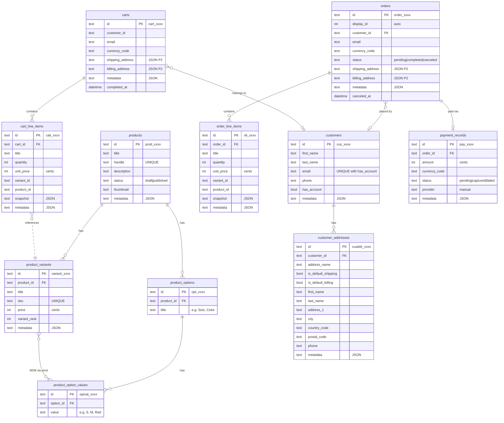
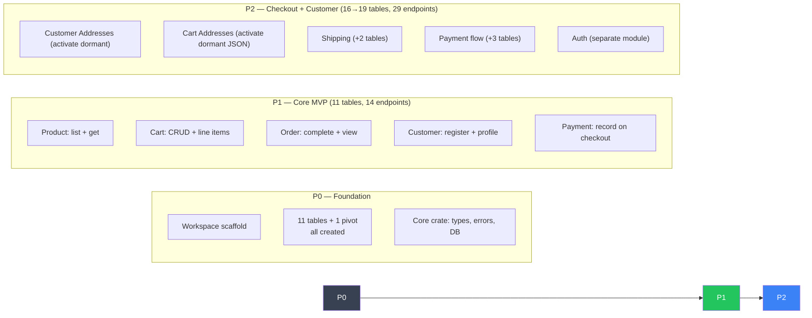

# toko-rs — Final MVP Schema (11 Tables)

> **Decision**: 11 tables + 1 pivot. JSON address fields on `carts` and `orders` exist from day one but are **dormant until P2**. All other data is relational.

---

## ER Diagram



---

## Phase Compatibility Matrix

### Schema Objects Usage by Phase

| # | Table | P0 | P1 | P2 | Notes |
|---|---|---|---|---|---|
| 1 | `products` | 🔧 created | ✅ active | ✅ active | |
| 2 | `product_options` | 🔧 created | ✅ active | ✅ active | |
| 3 | `product_option_values` | 🔧 created | ✅ active | ✅ active | |
| 4 | `product_variants` | 🔧 created | ✅ active | ✅ active | |
| — | `product_variant_options` *(pivot)* | 🔧 created | ✅ active | ✅ active | |
| 5 | `carts` | 🔧 created | ✅ active | ✅ active | `shipping_address`/`billing_address` JSON fields stay **NULL** in P1 |
| 6 | `cart_line_items` | 🔧 created | ✅ active | ✅ active | |
| 7 | `orders` | 🔧 created | ✅ active | ✅ active | `shipping_address`/`billing_address` JSON fields stay **NULL** in P1 |
| 8 | `order_line_items` | 🔧 created | ✅ active | ✅ active | |
| 9 | `customers` | 🔧 created | ✅ active | ✅ active | |
| 10 | `customer_addresses` | 🔧 created | 💤 dormant | ✅ active | Table exists but no P1 endpoint writes to it |
| 11 | `payment_records` | 🔧 created | ✅ active | ✅ active | Simple status tracking in P1; evolves in P2 |

### Dormant Fields (exist in schema, unused until P2)

| Table | Field | P1 State | P2 Activation |
|---|---|---|---|
| `carts` | `shipping_address` | NULL | `POST /store/carts/:id` writes JSON |
| `carts` | `billing_address` | NULL | `POST /store/carts/:id` writes JSON |
| `orders` | `shipping_address` | NULL | Snapshot from cart at checkout |
| `orders` | `billing_address` | NULL | Snapshot from cart at checkout |

> [!TIP]
> **Zero-migration transition**: All tables and columns are created in P0. Moving from P1 to P2 never requires `ALTER TABLE` — you just start using the dormant fields and tables.

---

## Endpoint Compatibility by Phase

### P1 — Core MVP (Browse → Cart → Checkout)

| Endpoint | Method | Tables Hit | Status |
|---|---|---|---|
| `/store/products` | GET | products, variants, options, option_values | ✅ |
| `/store/products/:id` | GET | products, variants, options, option_values | ✅ |
| `/store/carts` | POST | carts | ✅ |
| `/store/carts/:id` | GET | carts, cart_line_items | ✅ |
| `/store/carts/:id` | POST | carts *(email, currency_code — no address in P1)* | ✅ |
| `/store/carts/:id/line-items` | POST | cart_line_items, product_variants | ✅ |
| `/store/carts/:id/line-items/:line_id` | POST | cart_line_items | ✅ |
| `/store/carts/:id/line-items/:line_id` | DELETE | cart_line_items | ✅ |
| `/store/carts/:id/complete` | POST | carts, orders, order_line_items, payment_records | ✅ |
| `/store/orders` | GET | orders, order_line_items | ✅ |
| `/store/orders/:id` | GET | orders, order_line_items | ✅ |
| `/store/customers` | POST | customers | ✅ |
| `/store/customers/me` | GET | customers | ✅ |
| `/store/customers/me` | POST | customers | ✅ |

**P1 Score: 14/14 endpoints — 100% ✅**

---

### P2 — Checkout Flow + Customer Management

#### P2-A: Customer Addresses (no new tables needed)

| Endpoint | Method | Tables Hit | Status |
|---|---|---|---|
| `/store/customers/me/addresses` | GET | customer_addresses | ✅ |
| `/store/customers/me/addresses/:id` | GET | customer_addresses | ✅ |
| `/store/customers/me/addresses` | POST | customer_addresses | ✅ |
| `/store/customers/me/addresses/:id` | POST | customer_addresses | ✅ |
| `/store/customers/me/addresses/:id` | DELETE | customer_addresses | ✅ |

**P2-A Score: 5/5 — 100% ✅ (dormant table activates)**

#### P2-B: Cart Address Handling (no new tables needed)

| Endpoint | Method | What Happens | Status |
|---|---|---|---|
| `POST /store/carts/:id` with `shipping_address` | POST | Write JSON to `carts.shipping_address` | ✅ |
| `POST /store/carts/:id` with `billing_address` | POST | Write JSON to `carts.billing_address` | ✅ |
| `POST /store/carts/:id/complete` | POST | Snapshot JSON to `orders.shipping_address` | ✅ |

**P2-B Score: 3/3 — 100% ✅ (dormant fields activate)**

#### P2-C: Shipping (needs new tables)

| Endpoint | Method | Status | What's Needed |
|---|---|---|---|
| `GET /store/shipping-options` | GET | 🔴 | + `shipping_options` table |
| `POST /store/shipping-options/:id/calculate` | POST | 🔴 | + shipping calc logic |
| `POST /store/carts/:id/shipping-methods` | POST | 🔴 | + `cart_shipping_methods` table |

**P2-C: Needs +2 tables**

#### P2-D: Payment (needs new tables, evolves existing)

| Endpoint | Method | Status | What's Needed |
|---|---|---|---|
| `POST /store/payment-collections` | POST | 🔴 | + `payment_collections` table |
| `POST /store/payment-collections/:id/payment-sessions` | POST | 🔴 | + `payment_sessions` table |
| `GET /store/payment-providers` | GET | 🔴 | + `payment_providers` table |

**P2-D: Needs +3 tables** (payment_records evolves alongside)

#### P2-E: Taxes (needs new tables)

| Endpoint | Method | Status | What's Needed |
|---|---|---|---|
| `POST /store/carts/:id/taxes` | POST | 🔴 | + tax module (separate concern) |

**P2-E: Deferred to P3** — taxes require a full module (tax_regions, tax_rates, tax_providers)

---

### P2 Summary

| P2 Area | Endpoints | Works Now? | New Tables Needed |
|---|---|---|---|
| Customer Addresses | 5 | ✅ **Yes** | 0 (dormant table) |
| Cart Addresses | 3 | ✅ **Yes** | 0 (dormant fields) |
| Shipping | 3 | 🔴 No | +2 |
| Payments | 3 | 🔴 No | +3 |
| Taxes | 1 | 🔴 No | deferred |
| **Total** | **15** | **8 / 15 (53%)** | **+5 tables** |

---

## Phase Roadmap



| Phase | Tables | Endpoints | New Tables vs Previous |
|---|---|---|---|
| P0 | 11 + 1 pivot | 0 | — |
| P1 | 11 + 1 pivot | 14 | 0 (all exist from P0) |
| P2 | 16 + 1 pivot | 29 | +5 (additive only) |

---

## Final SQLite Migrations

### Migration 001 — Product Module

```sql
CREATE TABLE IF NOT EXISTS products (
    id TEXT PRIMARY KEY,
    title TEXT NOT NULL,
    handle TEXT NOT NULL,
    description TEXT,
    status TEXT NOT NULL DEFAULT 'draft'
        CHECK(status IN ('draft', 'published', 'proposed', 'rejected')),
    thumbnail TEXT,
    metadata TEXT,
    created_at DATETIME NOT NULL DEFAULT CURRENT_TIMESTAMP,
    updated_at DATETIME NOT NULL DEFAULT CURRENT_TIMESTAMP,
    deleted_at DATETIME
);
CREATE UNIQUE INDEX IF NOT EXISTS idx_product_handle ON products(handle) WHERE deleted_at IS NULL;
CREATE INDEX IF NOT EXISTS idx_product_status ON products(status) WHERE deleted_at IS NULL;

CREATE TABLE IF NOT EXISTS product_options (
    id TEXT PRIMARY KEY,
    product_id TEXT NOT NULL REFERENCES products(id) ON DELETE CASCADE,
    title TEXT NOT NULL,
    created_at DATETIME NOT NULL DEFAULT CURRENT_TIMESTAMP,
    updated_at DATETIME NOT NULL DEFAULT CURRENT_TIMESTAMP,
    deleted_at DATETIME
);
CREATE INDEX IF NOT EXISTS idx_product_option_product_id ON product_options(product_id) WHERE deleted_at IS NULL;

CREATE TABLE IF NOT EXISTS product_option_values (
    id TEXT PRIMARY KEY,
    option_id TEXT NOT NULL REFERENCES product_options(id) ON DELETE CASCADE,
    value TEXT NOT NULL,
    created_at DATETIME NOT NULL DEFAULT CURRENT_TIMESTAMP,
    updated_at DATETIME NOT NULL DEFAULT CURRENT_TIMESTAMP,
    deleted_at DATETIME
);
CREATE INDEX IF NOT EXISTS idx_option_value_option_id ON product_option_values(option_id) WHERE deleted_at IS NULL;

CREATE TABLE IF NOT EXISTS product_variants (
    id TEXT PRIMARY KEY,
    product_id TEXT NOT NULL REFERENCES products(id) ON DELETE CASCADE,
    title TEXT NOT NULL,
    sku TEXT,
    price INTEGER NOT NULL DEFAULT 0,
    variant_rank INTEGER DEFAULT 0,
    metadata TEXT,
    created_at DATETIME NOT NULL DEFAULT CURRENT_TIMESTAMP,
    updated_at DATETIME NOT NULL DEFAULT CURRENT_TIMESTAMP,
    deleted_at DATETIME
);
CREATE UNIQUE INDEX IF NOT EXISTS idx_variant_sku ON product_variants(sku) WHERE deleted_at IS NULL AND sku IS NOT NULL;
CREATE INDEX IF NOT EXISTS idx_variant_product_id ON product_variants(product_id) WHERE deleted_at IS NULL;

CREATE TABLE IF NOT EXISTS product_variant_options (
    variant_id TEXT NOT NULL REFERENCES product_variants(id) ON DELETE CASCADE,
    option_value_id TEXT NOT NULL REFERENCES product_option_values(id) ON DELETE CASCADE,
    PRIMARY KEY (variant_id, option_value_id)
);
```

### Migration 002 — Customer Module

```sql
CREATE TABLE IF NOT EXISTS customers (
    id TEXT PRIMARY KEY,
    first_name TEXT,
    last_name TEXT,
    email TEXT,
    phone TEXT,
    has_account INTEGER NOT NULL DEFAULT 0,
    metadata TEXT,
    created_at DATETIME NOT NULL DEFAULT CURRENT_TIMESTAMP,
    updated_at DATETIME NOT NULL DEFAULT CURRENT_TIMESTAMP,
    deleted_at DATETIME
);
CREATE UNIQUE INDEX IF NOT EXISTS idx_customer_email_account ON customers(email, has_account) WHERE deleted_at IS NULL;

-- Dormant in P1, active in P2
CREATE TABLE IF NOT EXISTS customer_addresses (
    id TEXT PRIMARY KEY,
    customer_id TEXT NOT NULL REFERENCES customers(id) ON DELETE CASCADE,
    address_name TEXT,
    is_default_shipping INTEGER NOT NULL DEFAULT 0,
    is_default_billing INTEGER NOT NULL DEFAULT 0,
    first_name TEXT,
    last_name TEXT,
    company TEXT,
    address_1 TEXT,
    address_2 TEXT,
    city TEXT,
    country_code TEXT,
    province TEXT,
    postal_code TEXT,
    phone TEXT,
    metadata TEXT,
    created_at DATETIME NOT NULL DEFAULT CURRENT_TIMESTAMP,
    updated_at DATETIME NOT NULL DEFAULT CURRENT_TIMESTAMP,
    deleted_at DATETIME
);
CREATE INDEX IF NOT EXISTS idx_customer_address_customer_id ON customer_addresses(customer_id) WHERE deleted_at IS NULL;
```

### Migration 003 — Cart Module

```sql
CREATE TABLE IF NOT EXISTS carts (
    id TEXT PRIMARY KEY,
    customer_id TEXT REFERENCES customers(id),
    email TEXT,
    currency_code TEXT NOT NULL DEFAULT 'usd',
    shipping_address TEXT,   -- JSON, dormant in P1
    billing_address TEXT,    -- JSON, dormant in P1
    metadata TEXT,
    completed_at DATETIME,
    created_at DATETIME NOT NULL DEFAULT CURRENT_TIMESTAMP,
    updated_at DATETIME NOT NULL DEFAULT CURRENT_TIMESTAMP,
    deleted_at DATETIME
);
CREATE INDEX IF NOT EXISTS idx_cart_customer_id ON carts(customer_id) WHERE deleted_at IS NULL AND customer_id IS NOT NULL;

CREATE TABLE IF NOT EXISTS cart_line_items (
    id TEXT PRIMARY KEY,
    cart_id TEXT NOT NULL REFERENCES carts(id) ON DELETE CASCADE,
    title TEXT NOT NULL,
    quantity INTEGER NOT NULL DEFAULT 1,
    unit_price INTEGER NOT NULL,
    variant_id TEXT,
    product_id TEXT,
    snapshot TEXT,   -- JSON: product/variant state at add-time
    metadata TEXT,
    created_at DATETIME NOT NULL DEFAULT CURRENT_TIMESTAMP,
    updated_at DATETIME NOT NULL DEFAULT CURRENT_TIMESTAMP,
    deleted_at DATETIME
);
CREATE INDEX IF NOT EXISTS idx_line_item_cart_id ON cart_line_items(cart_id) WHERE deleted_at IS NULL;
CREATE INDEX IF NOT EXISTS idx_line_item_variant_id ON cart_line_items(variant_id) WHERE deleted_at IS NULL AND variant_id IS NOT NULL;
```

### Migration 004 — Order Module

```sql
CREATE TABLE IF NOT EXISTS orders (
    id TEXT PRIMARY KEY,
    display_id INTEGER,
    customer_id TEXT REFERENCES customers(id),
    email TEXT,
    currency_code TEXT NOT NULL DEFAULT 'usd',
    status TEXT NOT NULL DEFAULT 'pending'
        CHECK(status IN ('pending', 'completed', 'canceled', 'requires_action', 'archived')),
    shipping_address TEXT,   -- JSON snapshot, dormant in P1
    billing_address TEXT,    -- JSON snapshot, dormant in P1
    metadata TEXT,
    canceled_at DATETIME,
    created_at DATETIME NOT NULL DEFAULT CURRENT_TIMESTAMP,
    updated_at DATETIME NOT NULL DEFAULT CURRENT_TIMESTAMP,
    deleted_at DATETIME
);
CREATE INDEX IF NOT EXISTS idx_order_customer_id ON orders(customer_id) WHERE deleted_at IS NULL;
CREATE INDEX IF NOT EXISTS idx_order_status ON orders(status) WHERE deleted_at IS NULL;
CREATE INDEX IF NOT EXISTS idx_order_display_id ON orders(display_id) WHERE deleted_at IS NULL;

CREATE TABLE IF NOT EXISTS order_line_items (
    id TEXT PRIMARY KEY,
    order_id TEXT NOT NULL REFERENCES orders(id) ON DELETE CASCADE,
    title TEXT NOT NULL,
    quantity INTEGER NOT NULL DEFAULT 1,
    unit_price INTEGER NOT NULL,
    variant_id TEXT,
    product_id TEXT,
    snapshot TEXT,   -- JSON: frozen product/variant state
    metadata TEXT,
    created_at DATETIME NOT NULL DEFAULT CURRENT_TIMESTAMP,
    updated_at DATETIME NOT NULL DEFAULT CURRENT_TIMESTAMP,
    deleted_at DATETIME
);
CREATE INDEX IF NOT EXISTS idx_order_line_item_order_id ON order_line_items(order_id) WHERE deleted_at IS NULL;
```

### Migration 005 — Payment

```sql
CREATE TABLE IF NOT EXISTS payment_records (
    id TEXT PRIMARY KEY,
    order_id TEXT NOT NULL REFERENCES orders(id),
    amount INTEGER NOT NULL,
    currency_code TEXT NOT NULL DEFAULT 'usd',
    status TEXT NOT NULL DEFAULT 'pending'
        CHECK(status IN ('pending', 'authorized', 'captured', 'failed', 'refunded')),
    provider TEXT NOT NULL DEFAULT 'manual',
    metadata TEXT,
    created_at DATETIME NOT NULL DEFAULT CURRENT_TIMESTAMP,
    updated_at DATETIME NOT NULL DEFAULT CURRENT_TIMESTAMP
);
CREATE INDEX IF NOT EXISTS idx_payment_order_id ON payment_records(order_id);
CREATE INDEX IF NOT EXISTS idx_payment_status ON payment_records(status);
```

---

## Medusa Full → MVP Comparison

| Medusa Module | Full Tables | MVP Tables | What Was Cut |
|---|---|---|---|
| Product | 11 + 3 pivot | 4 + 1 pivot | Images, types, tags, collections, categories, variant images |
| Cart | 10 | 2 | Adjustments, tax lines, shipping methods, shipping method adj/tax, credit lines, separate address table |
| Order | 21 | 2 | Versioning (OrderItem wrapper), order changes, order change actions, claims, claim items, claim images, exchanges, exchange items, returns, return items, return reasons, transactions, summaries, credit lines, shipping methods, all adjustment/tax line tables, separate address table |
| Customer | 4 | 2 | Customer groups, customer-group pivot |
| Payment | 9 | 1 | Payment collections, payment sessions, payment providers, payments, captures, refunds, refund reasons, account holders |
| Pricing | 6+ | 0 | Entire module → `price` field on variant |
| Region | 2 | 0 | Deferred |
| Currency | 1 | 0 | Deferred (hardcoded in `currency_code` fields) |
| Fulfillment | 8+ | 0 | Deferred |
| Tax | 4+ | 0 | Deferred |
| Sales Channel | 2 | 0 | Deferred |
| Store | 2 | 0 | Deferred |
| Auth | 2+ | 0 | Deferred |
| User | 3+ | 0 | Deferred |
| **Total** | **~55+** | **11 + 1 pivot** | **80% reduction** |
